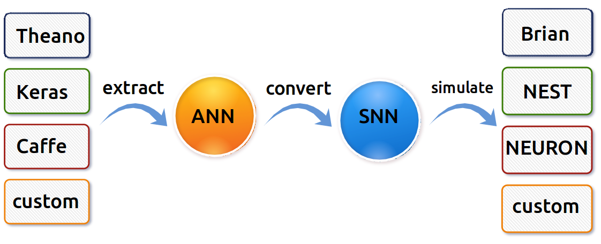
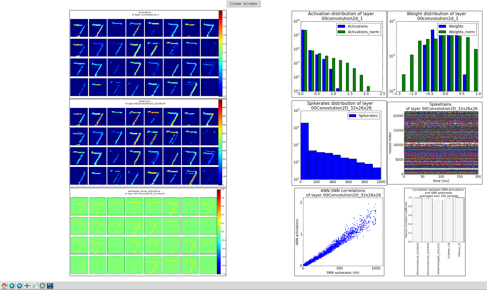

.. SNN toolbox documentation master file, created by
   sphinx-quickstart on Sun Mar 13 07:59:47 2016.
   You can adapt this file completely to your liking, but it should at least
   contain the root `toctree` directive.

Welcome to the SNN toolbox documentation!
=========================================

This is a toolbox for converting analog to spiking neural networks (ANN to SNN),
and running them in a spiking neuron simulator.

Citation
--------

::

	Diehl, P.U. and Neil, D. and Binas, J. and Cook, M. and Liu, S.C. and Pfeiffer, M.
	Fast-Classifying, High-Accuracy Spiking Deep Networks Through Weight and Threshold Balancing,
	IEEE International Joint Conference on Neural Networks (IJCNN), 2015

   **SNN toolbox workflow.** The input network (e.g. a Keras model) is transformed into an instance of the
   ``ANN`` class. The ``core.conversion`` module turns this into a spiking network. Finally, the 
   network can be evaluated in any spiking simulator that supports pyNN_ as input. At any stage of the 
   pipeline, models and results can be written to disk (see :py:mod:`io.save` in :doc:`modules`).

Features
--------

* Before conversion, the input model is parsed into a custom class :py:class:`core.SNN.SNN`
  containing only essential model structure and weights in common python containers.
  The conversion toolbox currently supports input networks generated with Keras or Lasagne.
  See :doc:`getting_started` on how to extend the relevant methods to handle models from other 
  common libraries like caffe, torch etc.
* During conversion of the analog neural network to spiking, the toolbox allows normalizing model parameters
  for achieving higher accuracy in the converted net.
  Batch normalization layers are absorbed into the preceeding layer to save computations at runtime.
* The resulting spiking network can then be exported to be tested in spiking simulators. The export format depends on the target
  simulator. See :doc:`getting_started` on how to add a simulator to the toolbox.
* The toolbox currently provides the following output formats:

    - `pyNN <http://neuralensemble.org/docs/PyNN/>`_ models. pyNN is a simulator-independent language for building neural network
      models. It allows running the converted net in a spiking simulator like `Brian <http://briansimulator.org/>`_,
      `Nest <http://www.nest-simulator.org/>`_, `Neuron <https://www.neuron.yale.edu/neuron/>`_,
      or by a custom simulator that allows pyNN models as inputs.
    - Models to be run in `Brian2 <http://brian2.readthedocs.io/en/latest/index.html#>`_.
    - An output format based on Keras models that can be run for instance on a built-in simulator developed at the University of Zurich.

* In addition to supporting the simulators listed above, the toolbox includes a ready-to-use
  simulator developed at INI. This simulator features a very simple integrate-and-fire neuron.
  By dispensing with redundant parameters and implementing a highly parallel simulation, the run time
  is reduced by several orders of magnitude, without compromising accuracy.
* Examples for both convolutional networks and fully-connected networks on MNIST and CIFAR10 are provided.
* So far, this toolbox is able to handle classification datasets. For other applications,
  the ``io.load.get_dataset`` module needs to be extended.

.. figure:: gui_parameters.png
   :scale: 50 %
   :alt: Snapshot of the SNN toolbox GUI.

   **SNN toolbox GUI.** In the main window, the user can specify which tools to use during the experiment (e.g. whether or not to normalize weights prior to conversion, to evaluate the ANN before converting, to load an already converted net and simulate only, etc.). Also, parameters of the neuron cells used during simulation can be set. The GUI saves and reloads last settings automatically, and allows saving and loading preferences manually. Tooltips explain all functionality.

   **SNN toolbox GUI plot window.** The toolbox looks for plots in the specified working directory. The user can select one or several layers, for which the results of a test run will be displayed in a way that facilitates examining and comparing results of each layer of the network. The example above compares ANN activations to SNN spikerates for the first convolutional layer on the MNIST dataset.

.. toctree::
   :maxdepth: 3

   getting_started
   configure_toolbox
   modules
   Tests <tests>

Indices and tables
==================

* :ref:`genindex`
* :ref:`modindex`
* :ref:`search`

