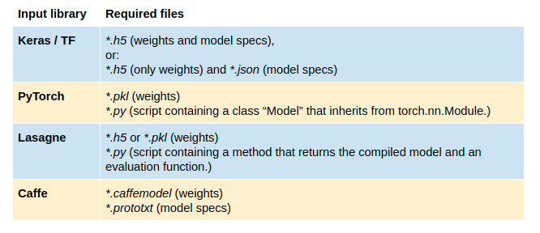
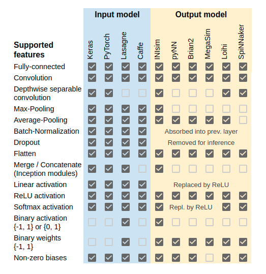
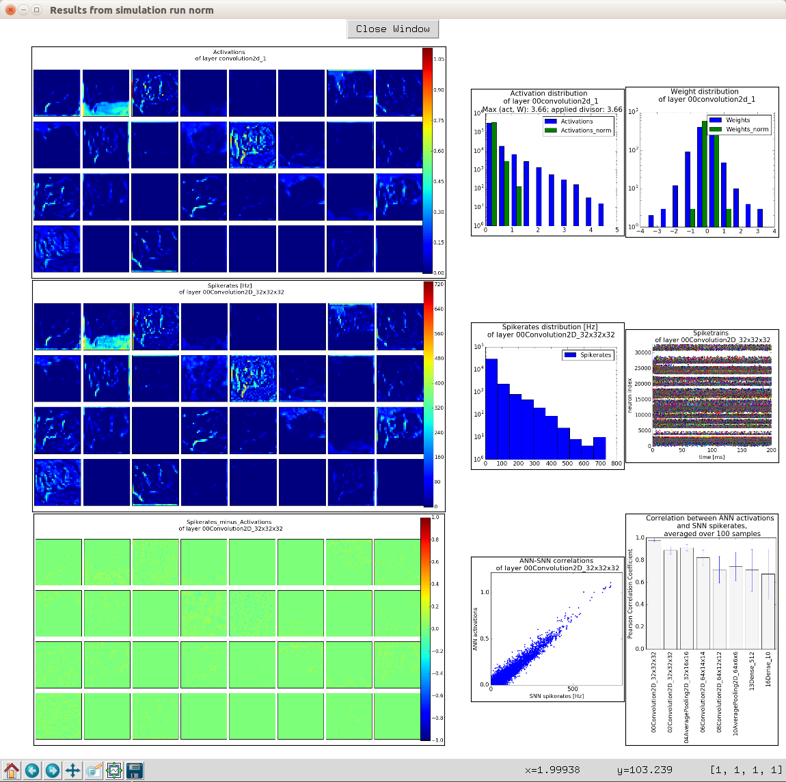

.. # coding=utf-8

Introduction
============

This is a toolbox for converting analog to spiking neural networks (ANN to SNN),
and running them in a spiking neuron simulator.

.. figure:: images/workflow.png
   :scale: 50 %
   :alt: Workflow diagram of the SNN toolbox.

Internal workflow
-----------------

Parsing and converting
**********************

Given a model written in one of the libraries specified above, the toolbox parses the provided network files by extracting the relevant information and creating an equivalent Keras model from it. This parsed model serves as common abstraction layer from the input and is internally used by the toolbox to perform the actual conversion to a spiking network.

The conversion toolbox currently supports input networks generated with `Keras <https://keras.io/>`_, `Lasagne <https://lasagne.readthedocs.io/en/latest/>`_, or `Caffe <http://caffe.berkeleyvision.org/>`_. See :doc:`extending` on how to extend the relevant methods to handle models from other common libraries like Torch.

The following table lists the input files expected by the toolbox.

The second column in the following table summarized which features of the input model the toolbox knows about and can handle. 

.. _simulating:

Simulating
**********

After the input model has been converted, the resulting spiking network can be exported for simulation in a spiking simulator or deployment on dedicated spiking neuron chips. Currently, the following output formats are supported (see :doc:`extending` on how to add a simulator to the toolbox):

    - `pyNN <http://neuralensemble.org/docs/PyNN/>`_ models. pyNN is a simulator-independent language for building neural network
      models. It allows running the converted net in a spiking simulator like `Brian <http://briansimulator.org/>`_,
      `Nest <http://www.nest-simulator.org/>`_, `Neuron <https://www.neuron.yale.edu/neuron/>`_,
      or by a custom simulator that allows pyNN models as inputs.
    - `Brian2 <http://brian2.readthedocs.io/en/latest/index.html#>`_.
    - The toolbox integrates MegaSim, an event-driven asynchronous spiking simulator developed at the University of Seville.
    - The toolbox provides a built-in simulator based on Keras, called INIsim. This simulator features a very simple integrate-and-fire neuron. By dispensing with redundant parameters and implementing a highly parallel simulation, the run time is reduced by several orders of magnitude, without compromising accuracy.

The second column in the table below compares these different simulators with respect to the network features that can be implemented on them.

Additionaly, a number of experimental features were implemented to improve and test the spiking network. They are currently only available in INIsim, and include:
   - Clamping of membrane potentials for a given time for each layer.
   - Clipping membrane potentials to certain bounds.
   - Activity-dependent adaptation of spike thresholds of each layer.
   - Bias-relaxation.
   - Spikes with payloads.
   - Various reset mechanisms after spikes.
   - Logging and visualization functions to monitor and debug simulation.
   - Different input types: In all other simulators, only Poisson input is supported at the moment. INIsim implements constant input currents as well as input from DVS event sequences.
   - Batch-wise testing.

GUI (beta)
----------

.. figure:: images/gui_parameters.png
   :scale: 50 %
   :alt: Snapshot of the SNN toolbox GUI.

   **SNN toolbox GUI.** In the main window, the user can specify which tools to use during the experiment. Also, parameters of the neuron cells used during simulation can be set. The GUI saves and reloads last settings automatically, and allows saving and loading preferences manually. Tooltips explain all functionality.

   **SNN toolbox GUI plot window.** The toolbox looks for plots in the specified working directory. The user can select one or several layers, for which the results of a test run will be displayed in a way that facilitates examining and comparing results of each layer of the network. The example above compares ANN activations to SNN spikerates for the first convolutional layer on the MNIST dataset.

